# Radar de Vagas

Radar de Vagas e um projeto Python que automatiza a busca de oportunidades aderentes a um perfil profissional, aplica filtros e scoring deterministico, gera curriculos ATS em DOCX e envia vagas priorizadas para o Discord.

## Problema

Buscar vagas manualmente em varias fontes costuma gerar:

- muito ruido e baixa aderencia;
- repeticao de vagas entre plataformas;
- perda de tempo com oportunidades fora do escopo;
- dificuldade para adaptar curriculos de forma consistente;
- falta de rastreabilidade sobre o que ja foi visto, rejeitado ou enviado.

## Solucao

O projeto organiza esse fluxo ponta a ponta:

- consulta providers de vagas;
- normaliza e deduplica resultados;
- aplica pre-filtro, regras eliminatorias e score de `0` a `100`;
- seleciona apenas conteudo verdadeiro do perfil-base;
- gera curriculos lineares e compativeis com ATS;
- envia uma vaga por mensagem no Discord com anexo;
- persiste o estado operacional com retries e auditoria.

## Arquitetura

```mermaid
flowchart LR
    A[Jooble / Remotive] --> B[Normalizacao]
    B --> C[Pre-filtro]
    C --> D[Deduplicacao]
    D --> E[Scoring]
    E --> F[Fila e Estado]
    F --> G[Selecao de Conteudo]
    G --> H[Curriculo ATS em DOCX]
    H --> I[Validacao]
    I --> J[Discord]
    J --> K[Historico Operacional]
```



Documentacao detalhada:

- [Arquitetura](docs/architecture.md)
- [Execucao e workflows](docs/execution.md)
- [Operacoes e estado](docs/operations.md)
- [Seguranca e privacidade](docs/security.md)
- [Roadmap](docs/roadmap.md)

## Maquina de Estados

O ciclo de vida das vagas segue estados explicitos:

```text
QUEUED -> RESUME_GENERATED -> NOTIFIED
RETRY_PENDING -> QUEUED
RETRY_PENDING -> DEAD_LETTER
REJECTED e NOTIFIED sao estados finais
```

Isso evita perder vagas elegiveis fora do limite por execucao e permite retry de falhas transitorias.

## Stack

- Python 3.12+
- `uv.lock` versionado para reproducibilidade de dependencias
- `httpx`
- `pydantic` e `pydantic-settings`
- `PyYAML`
- `tenacity`
- `python-docx`
- `pytest`, `pytest-cov`, `respx`, `ruff`
- GitHub Actions

## Confiabilidade

- deduplicacao por `provider_job_id`, hash da URL normalizada e `fingerprint`;
- escrita atomica do historico;
- migracao de schema com backup;
- retries com backoff deterministico;
- dead letter para falhas persistentes;
- isolamento de falhas por provider;
- `dry-run` sem persistencia nem notificacao;
- branch dedicada `radar-state` para estado operacional.

## Seguranca

- secrets fora do repositorio;
- perfil profissional real mantido apenas em `config/candidate_profile.local.yaml`;
- workflow de CI separado do workflow produtivo;
- secrets injetados somente nos passos necessarios do workflow produtivo;
- artifacts apenas sanitizados;
- logs sem webhook, chave, email ou telefone;
- historico `v3` com minimizacao de dados.

Mais detalhes em [docs/security.md](docs/security.md).

## Testes

Validacao recomendada:

```powershell
ruff check .
pytest
pytest --cov=src/radar_vagas --cov-report=term-missing
```

O repositorio mantem `uv.lock`, mas os comandos com `pip install -e ".[dev]"` continuam suportados.

## Demonstracao

Fluxo principal:

```powershell
python -m radar_vagas --dry-run --save-resumes --verbose
```

Geracao de curriculo a partir de fixture:

```powershell
python -m radar_vagas --generate-resume tests/fixtures/jobs/bi_job.json
```

Teste do webhook:

```powershell
python -m radar_vagas --test-discord
```

## Execucao Local

### Windows

```powershell
py -3.12 -m venv .venv
.\.venv\Scripts\Activate.ps1
python -m pip install --upgrade pip
pip install -e ".[dev]"
```

### Configuracao

Arquivos principais:

- `.env`
- `config/profile.yaml`
- `config/candidate_profile.local.yaml`
- `config/candidate_profile.example.yaml`

Exemplo minimo de `.env`:

```dotenv
DISCORD_WEBHOOK_URL=
JOOBLE_API_KEY=
CANDIDATE_EMAIL=
CANDIDATE_PHONE=
CANDIDATE_PROFILE_PATH=config/candidate_profile.local.yaml
LOG_LEVEL=INFO
ENVIRONMENT=development
```

Comandos uteis:

```powershell
python -m radar_vagas
python -m radar_vagas --dry-run
python -m radar_vagas --provider remotive --max-jobs 3 --verbose
python -m radar_vagas --provider jooble --term "Analista de Dados" --location "Curitiba"
```

## GitHub Actions

O repositorio usa dois workflows:

- `.github/workflows/ci.yml`
- `.github/workflows/radar.yml`

Resumo:

- `CI`: lint e testes, sem secrets produtivos;
- `Radar de Vagas`: execucao agendada e manual, com estado operacional em `radar-state`.

Secrets obrigatorios do workflow produtivo:

- `DISCORD_WEBHOOK_URL`
- `JOOBLE_API_KEY`
- `CANDIDATE_EMAIL`
- `CANDIDATE_PHONE`
- `CANDIDATE_PROFILE_YAML`

## Estrutura

```text
radar-vagas-discord/
|-- .github/
|   |-- dependabot.yml
|   `-- workflows/
|       |-- ci.yml
|       `-- radar.yml
|-- config/
|-- Context/
|-- data/
|-- docs/
|   |-- architecture.md
|   |-- execution.md
|   |-- operations.md
|   |-- roadmap.md
|   `-- security.md
|-- output/
|-- src/
|   `-- radar_vagas/
|-- tests/
|-- .gitattributes
|-- AGENTS.md
|-- CONTEXTO_RADAR_VAGAS_DISCORD.md
|-- GUIA_CODEX_RADAR_VAGAS_DISCORD.md
|-- LICENSE
`-- README.md
```

## Limitacoes

- a qualidade dos resultados depende do que os providers retornam;
- Jooble e Remotive podem trazer bastante ruido para termos amplos;
- o orcamento do curriculo e heuristico, nao visual;
- o scoring continua deterministico e nao usa IA generativa;
- a elegibilidade final ainda depende de revisao humana antes da candidatura.

## Roadmap

- reduzir ainda mais o ruido dos providers com melhor filtragem semantica;
- ampliar diagnosticos locais para inspecao de fila e retries;
- revisar continuamente os pesos e aliases do scoring;
- evoluir a documentacao com exemplos sanitizados de execucao;
- fortalecer ainda mais a observabilidade da branch `radar-state`.

## Licenca

Este projeto esta licenciado sob a [MIT License](LICENSE).

## Especificacao

Os arquivos abaixo continuam sendo a base principal dos requisitos do projeto:

- `CONTEXTO_RADAR_VAGAS_DISCORD.md`
- `GUIA_CODEX_RADAR_VAGAS_DISCORD.md`
- `PLANO_REAJUSTE_RADAR_VAGAS_CODEX.md`
