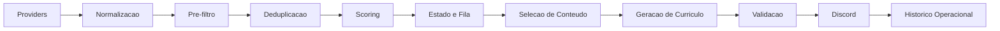
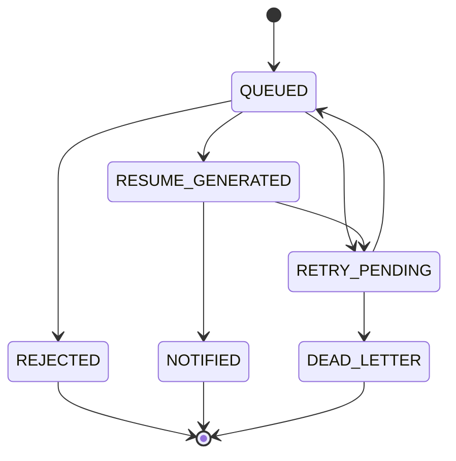

# Arquitetura

## Visao Geral

O Radar de Vagas organiza um pipeline deterministico para transformar resultados brutos de providers em oportunidades priorizadas com curriculo ATS e notificacao no Discord.



## Componentes Principais

### Providers

- `Jooble`
- `Remotive`

Responsabilidades:

- consultar a fonte remota;
- aplicar timeout e retry conforme o provider;
- normalizar resultados para `JobPosting`.

### Normalizacao e deduplicacao

Responsabilidades:

- padronizar texto e URLs;
- reduzir duplicatas dentro da execucao;
- manter a ordem de deduplicacao:
  - `provider + provider_job_id`
  - hash da URL normalizada
  - `fingerprint`

### Scoring

Responsabilidades:

- aplicar filtros eliminatorios;
- calcular score de `0` a `100`;
- separar aderencia, lacunas e razoes de rejeicao;
- produzir explicacao auditavel.

### Estado operacional

Responsabilidades:

- registrar retries, dead letter e historico;
- permitir reprocessamento seguro;
- minimizar os dados persistidos;
- manter escrita atomica e migracao de schema.

### Curriculos

Responsabilidades:

- extrair palavras-chave da vaga;
- selecionar somente conteudo aprovado no perfil-base;
- gerar DOCX linear compativel com ATS;
- validar estrutura, placeholders e claims proibidos.

### Notificacao

Responsabilidades:

- enviar uma vaga por mensagem;
- anexar o curriculo correspondente;
- respeitar limites e retries do Discord;
- nao expor dados sensiveis no corpo da mensagem.

## Maquina de Estados



Estados finais:

- `REJECTED`
- `NOTIFIED`
- `DEAD_LETTER`

## Estrutura do pacote

```text
src/radar_vagas/
├── cli.py
├── config.py
├── deduplication.py
├── models.py
├── pipeline.py
├── scoring.py
├── storage.py
├── text_utils.py
├── notifications/
├── providers/
└── resumes/
```

## Decisoes tecnicas relevantes

- scoring e selecao de curriculo sao deterministicos;
- estado operacional fica separado do fluxo de codigo via branch `radar-state`;
- CI e workflow produtivo ficam separados;
- historico persistido e minimizado no schema `v3`;
- o sistema nao depende de IA generativa para ranking nem para gerar texto factual.
